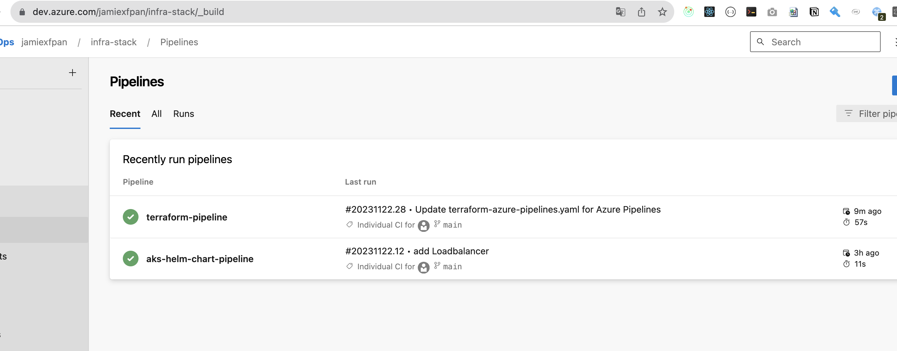

# Introduction 
This is the Code Challenge for Azure Kubernetes and other relevant Azure Infra.
There are two parts for the whole challenge:
  - Azure Infra: Resource Group, AKS, Storage Account (TF statefile), Azure DNS
  - IaC: Terraform
  - Kubernetes Applications: Helm-Chart

# Two Pipelines
Pipelines will be triggered once the new changes merged into "Main" branch.
- Terraform pipeline
- Helm-Chart Pipeline

